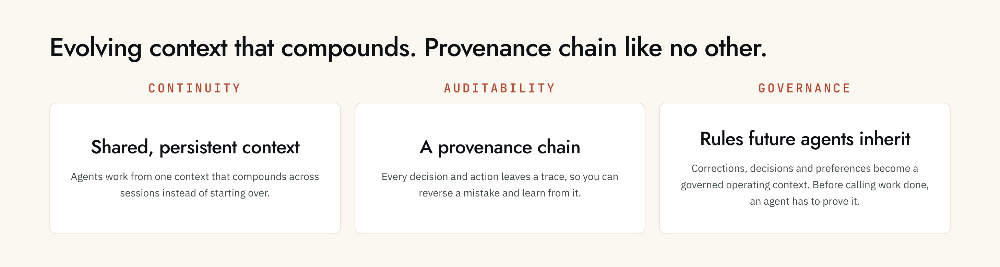

<p align="center">
  
</p>

<p align="center">
  <a href="https://docs.5thdev.ai/"></a>
  <a href="https://discord.com/channels/1496699350439563347/"></a>
  <a href="https://www.cognisos.ai/"></a>
</p>

<p align="center">
  <a href="https://5thdev.ai">Website ↗</a> ·
  <a href="https://docs.5thdev.ai">Docs ↗</a> ·
  <a href="#try-the-local-beta">Try the beta</a> ·
  <a href="https://github.com/cognisos-ai/5thDev/issues">Feedback ↗</a>
</p>

Agents are remarkably capable. The hard part is keeping them grounded when the
work gets long, branches move, and more than one agent touches the same system.

**5thDev is the reliability layer we are building for that problem.** Fabric,
our first product, gives supported agents durable context, local code
intelligence, and governed workflows so each session does not have to start
from zero.

This repository is the public front door for the product: what is available,
how to try it, and where to report what does not work. The production source
remains private.

<p align="center">
  
</p>

## What you can use today

The current beta runs locally and connects to the MCP clients you already use.
It builds a local understanding of your project, keeps that understanding fresh,
and exposes focused tools for querying code, tracing impact, checking contracts,
understanding recent changes, and carrying useful context between agent
sessions.

- **Local first.** Your local code index stays on your machine.
- **Works where you work.** Setup detects supported MCP clients and registers
  the verified local connector.
- **Evidence over confidence.** Status, provenance, governance, and health
  checks are part of the product surface—not an afterthought.
- **One shared context layer.** Code intelligence and session continuity are
  available to different supported agents without maintaining another pile of
  hand-written context files.

We are still closing the full release-proof path around the current candidate.
That is why the command below uses the explicit `beta-candidate` channel rather
than pretending the older `latest` tag is current.

## Try the local beta

You need Node.js **20.18.1 or newer** and a supported macOS, Linux, or Windows
machine.

From the project you want Fabric to understand:

```bash
npx -y @cognisos/fabric-mcp@beta-candidate setup
```

Complete the browser sign-in, then run:

```bash
npx -y @cognisos/fabric-mcp@beta-candidate doctor
```

Restart the MCP client you want to use and begin a **new conversation**. Existing
conversations can retain an older tool list even after a correct installation.

For a repeatable fresh-machine check, use the
[clean-machine validation guide](./docs/clean-machine-validation.md).

## Local Fabric and Hosted Fabric

| | Local Fabric — available in beta | Hosted / Shared Fabric — in development |
|---|---|---|
| Best for | Developers working with agents in a local codebase | People and teams who need shared, governed context without managing a local setup |
| Authority | Local project state and local stores | Tenant- and organization-scoped cloud authority |
| Source handling | Local indexing; source does not leave the machine as part of ordinary local indexing | Explicit, policy-controlled ingestion and sharing boundaries |
| Status | Available through `beta-candidate` | Not presented here as a finished product |

The goal is not to turn the local database into a cloud service. Local and
hosted modes should share product contracts while using storage and access
models appropriate to where they run. Sync and team sharing will be explicit,
permissioned actions—not a silent upload of local memory.

## What we would like tested

If you are trying the beta, the most useful feedback is ordinary product use:

1. Does setup and browser authorization complete cleanly?
2. Does `doctor` pass without manual filesystem or keychain repair?
3. Can an agent find a real symbol, explain its dependencies, and stay within a
   requested context budget?
4. After restarting the client, does the project remain healthy and useful?
5. When something fails, is the diagnostic specific enough to act on?

Please open an [issue](https://github.com/cognisos-ai/5thDev/issues) with the
package version, operating system, Node.js version, failing stage, and sanitized
`doctor` output. Never post API keys, credentials, private source, or unredacted
environment values.

## Release evidence

Signed Liminal/Fractal runtime binaries and their verification evidence live in
[`cognisos-ai/liminal-releases`](https://github.com/cognisos-ai/liminal-releases).
That repository is deliberately narrow: it is a distribution and evidence
channel, not the general FifthDev product repository.

## Support and security

- Product questions and setup problems: [Support](./SUPPORT.md)
- Sensitive security reports: [Security policy](./SECURITY.md)
- Product documentation: [docs.5thdev.ai](https://docs.5thdev.ai)

---

<p align="center">
  Built by <a href="https://5thdev.ai">5thDev</a> · © 2026 Cognisos, Inc. All rights reserved.
</p>
